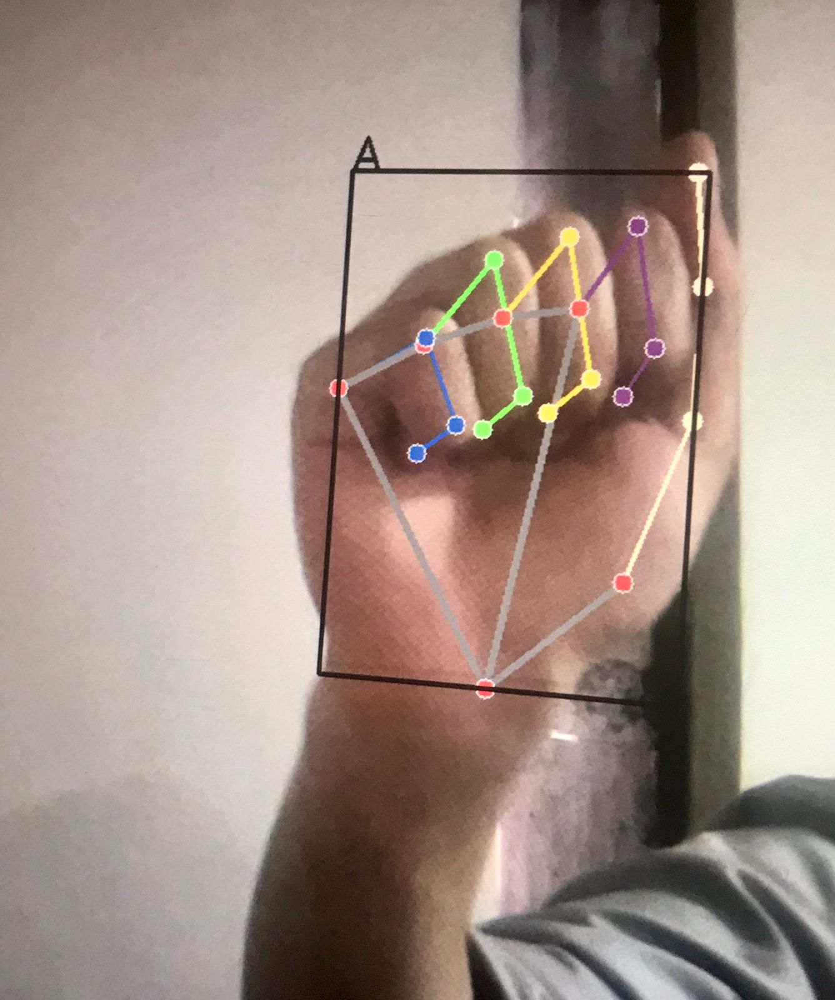
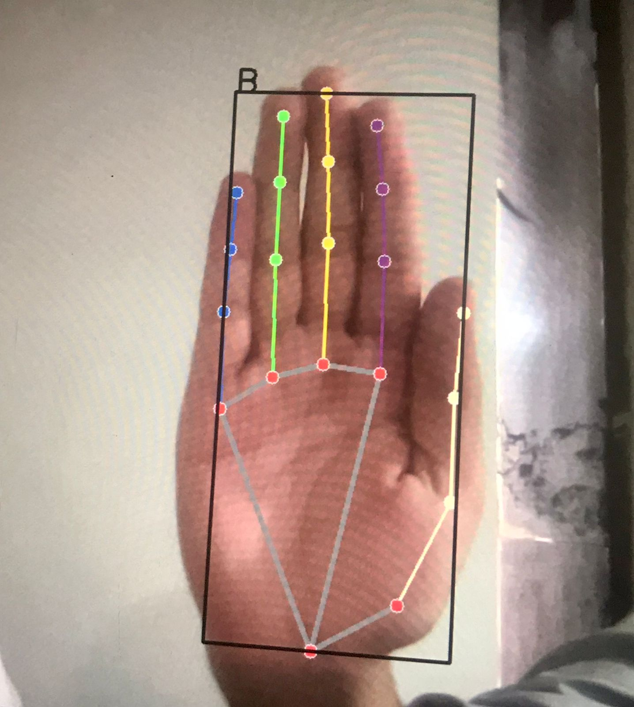
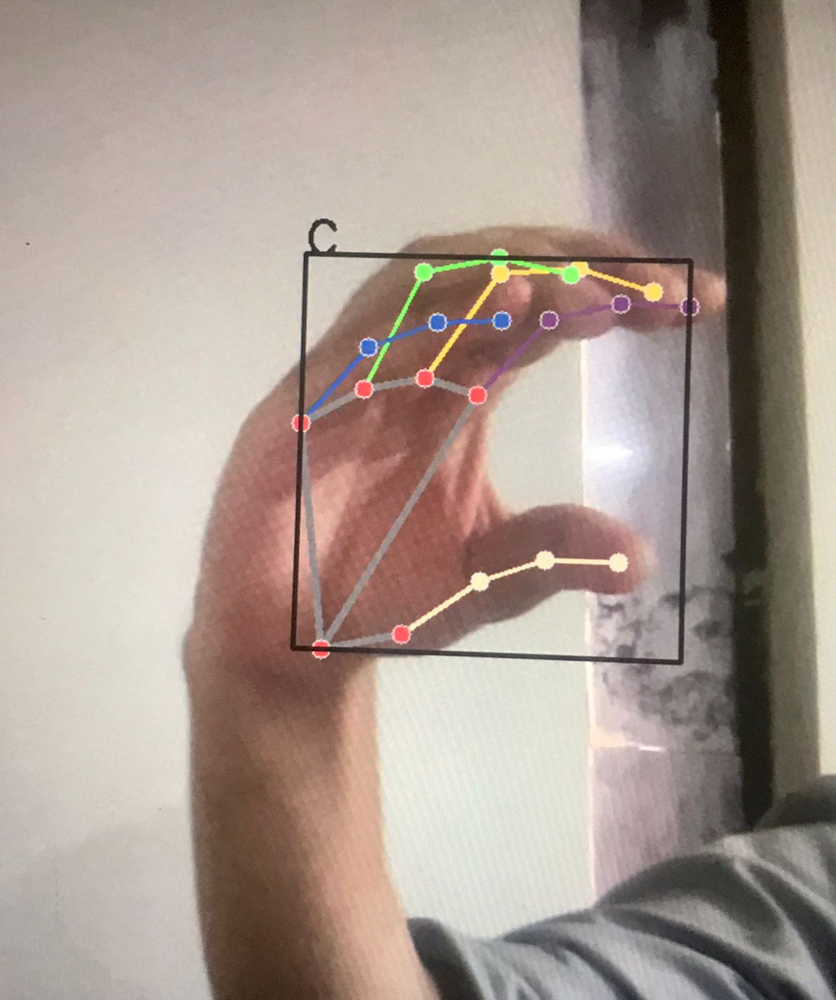
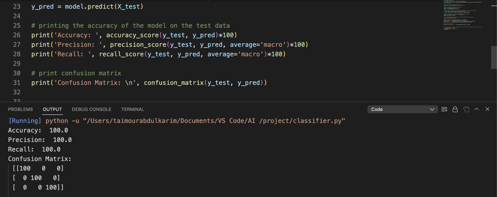
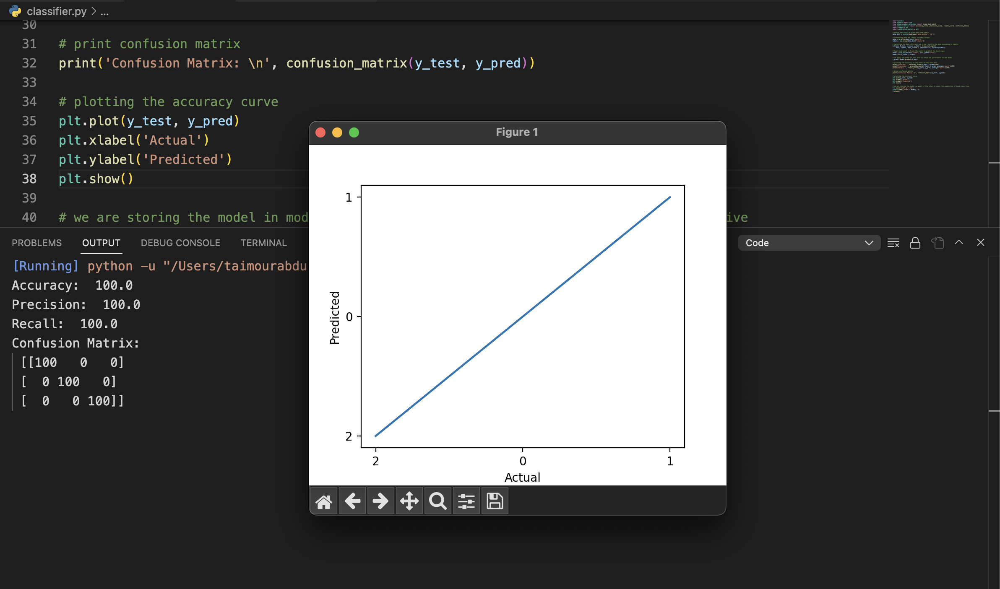

<h1 style="text-align:center;">Sign Language Detection Project</h1>

This project is aimed at developing an AI-based system that can detect sign languages in real-time.

## Introduction ##

Sign language is a visual language that is used by deaf and hard-of-hearing people to communicate with each other. While it is a very effective means of communication, it can be difficult for people who do not know the language to understand. This is where our project comes in. 

Our project aims to develop a system that can detect sign languages and translate them into text or speech. This will enable people who do not know sign language to communicate with people who do.

## Approach ##

Our approach to building this system involves training a deep learning model on a large dataset of sign language videos. We will be using a combination of computer vision and natural language processing techniques to detect the signs and translate them.

The dataset we will be using is our own image dataset, which contains over 500 images of each class of the American Sign Language alphabet. We will use support vector machine to train the model tp predict the sign languages and apply the model to the real time video to predict the sign language.

We will also use natural language processing techniques to convert the detected signs into text or speech. For this, we will use use the trained model and predict the signs in real time.

## Creating Images ##

The collect_images.py file is used to make 3 classes of any 3 alphabet hand sign and take 500 images of that hand sign and store it in the images directory as specified.

### Steps ###

1. Importing necessary libraries: The code imports various libraries, including os, cv2 (OpenCV), mediapipe, matplotlib.pyplot, and pickle.
2. Setting the image directory: The code defines the directory where the images are stored using the variable data_dir.
3. Setting up modules and classes from the mediapipe library: The code initializes variables to store different modules and classes from the mediapipe library. These modules and classes are used for hand landmark detection and drawing.
4. Initializing empty lists: Two empty lists, data and labels, are created to store the extracted hand landmark data and corresponding labels, respectively.
5. Looping through the image directories: The code iterates through the directories within the specified data_dir directory.
6. Looping through the images in each directory: For each directory, the code loops through the images contained within it.
7. Processing each image:
      * An empty list, data_auxiliary, is created to store the extracted hand landmark data for the current image.
      * The image is read using cv2.imread and stored in the variable img.
      * The image is converted from BGR to RGB using cv2.cvtColor and stored in the variable img_rgb.
      * The hand object's process method is used to detect hand landmarks in the image, and the result is stored in the variable result.
      * Checking if hand landmarks were detected in the image using result.multi_hand_landmarks.
      * If hand landmarks are detected, the code loops through each detected hand landmark.
      * For each hand landmark, the x and y coordinates are extracted and stored in the data_auxiliary list.
      * The data_auxiliary list is then appended to the data list, representing the hand landmark data for the current image.
      * The label of the image (the directory name) is appended to the labels list.
8. Storing the data and labels: After processing all the images, a dataset dictionary containing the data and labels lists is created. The dictionary is then dumped into a file named 'data.pickle' using the pickle.dump method. This file will store the extracted hand landmark data and corresponding labels.
9. Closing the file: Finally, the file is closed using the close method.

## Creating Dataset ##

After taking the images, the next step is creating the data set. The create_dataset.py file reads all the images and assign them label. Afterwards using mediapipe library the hand landmarks are made and drawn on the frame and store the axis of those landmarks and store it in a data dict. 

Now, we have labels and hand landmarks data. Finally, we create the final dataset containing labels and hand landmarks.

### Steps ###

1. Importing necessary libraries: The code imports the required libraries, including os for file and directory operations, cv2 for image processing, mediapipe for hand landmark detection, matplotlib.pyplot for visualization, and pickle for data serialization.
2. Defining the image directory: The code sets the directory path where the images are located using the variable data_dir.
3. Setting up the hand landmark detection: The code initializes the mp_hands.Hands class from the mp.solutions.hands module for detecting hand landmarks in the images. It also stores other modules related to drawing and styles for later use.
4. Creating empty lists for data and labels: The code initializes empty lists to store the hand landmark data and corresponding labels.
5. Looping through the directories and images: The code iterates over the directories within the data_dir using os.listdir(). Within each directory, it loops over the image files using os.listdir() again.
6. Processing each image: For each image, the code performs the following steps:
    * Reads the image using cv2.imread() and stores it in the img variable.
    * Converts the image from BGR to RGB using cv2.cvtColor() and stores it in the img_rgb variable.
    * Uses hand.process() to detect hand landmarks in the RGB image and stores the result in the result variable.
7. Extracting hand landmarks: If the result has detected hand landmarks, the code proceeds to extract the landmarks' coordinates. For each hand detected in the image:
    * Creates an empty list (data_auxilary) to store the landmarks' coordinates.
    * Iterates over the landmarks and retrieves the x and y coordinates.
    * Appends the x and y coordinates to data_auxilary.
    * Appends data_auxilary to the data list.
    * Appends the directory name (label) to the labels list.
8. Serializing the data: After processing all images, the code opens a file named 'data.pickle' in write-binary mode using open('data.pickle', 'wb'). It then uses pickle.dump() to store the data and labels dictionary ({'data': data, 'labels': labels}) into the file.
9. Closing the file: Finally, the code closes the file using f.close().

## Classifier ##

The classifier.py is used to train the model to predict the hand signs. Firstly, we would read the dataset file that we created then apply a classificaton model such as support vector machine to train the model.

Afterwards, the dataset is split into train and test. Model is trained of train data and then accuracy is check on the test data. The model is then stored in a model.p file to be later used for real time prediction.

### Steps ###

1. Importing necessary libraries: The code imports the required libraries, including pickle for data serialization, svm from scikit-learn for Support Vector Machine models, train_test_split from scikit-learn for splitting the data into training and testing sets, accuracy_score from scikit-learn for evaluating the model's accuracy, and numpy for array operations.
2. Loading the data: The code loads a data dictionary from a file named 'data.pickle' using the pickle.load() function. The data dictionary contains two keys: 'data' and 'labels', which store the input data and corresponding labels.
Converting data and labels to numpy arrays: The code converts the data and labels from the data dictionary into numpy arrays using np.array().
3. Splitting the data into train and test sets: The code uses the train_test_split() function to split the data and labels into training and testing sets. It assigns 80% of the data to the training set (X_train and y_train) and 20% to the test set (X_test and y_test). The data is shuffled according to the labels using shuffle=True and stratified to maintain the class distribution using stratify=labels.
4. Training an SVM model: The code creates an SVM model object (model) using svm.SVC with a linear kernel, regularization parameter C=1, and automatic gamma calculation (gamma='auto'). The model is trained using the training data (X_train and y_train) with the fit() method.
5. Evaluating the model: The code applies the trained model to the test data (X_test) to make predictions using the predict() method, storing the predicted labels in y_pred. It then calculates the accuracy of the model's predictions on the test data using the accuracy_score() function, comparing the predicted labels (y_pred) with the true labels (y_test).
6. Printing the accuracy: The code prints the accuracy of the model on the test data by displaying the result of the accuracy_score() function.
7. Storing the model: The code opens a file named 'model.p' in write-binary mode using open('model.p', 'wb'). It then uses pickle.dump() to store the trained model ({'model': model}) in the file. Finally, it closes the file using f.close(). The purpose of storing the model is to be able to load and use it later for making predictions on new, unseen data.

### Classifying Images ###

### Image A ###

### Image B ###

### Image C ###

### ###

## Technologies Used ##

The following technologies will be used in this project:

* Python
* Mediapipe
* Support Vector Machine
* OpenCV
* Project Goals

## SVM ## 

Support Vector Machines (SVMs) are a popular machine learning algorithm that can be used for both classification and regression tasks. Here are the pros and cons of using SVMs:

### Pros ###

* Effective in high-dimensional spaces: SVMs perform well even when the number of features is greater than the number of samples. They can handle large feature spaces effectively, making them suitable for complex problems.
* Good generalization: SVMs aim to find a decision boundary with the largest margin, which leads to better generalization. They tend to have lower error rates on unseen data compared to other algorithms.
* Ability to handle non-linear data: SVMs can handle non-linear data by using kernel functions, which transform the original feature space into a higher-dimensional space, allowing non-linear decision boundaries to be learned.
* Robust to outliers: SVMs are less affected by outliers because they focus on maximizing the margin. Outliers located far from the decision boundary have less impact on the model.
* Theoretical foundation: SVMs have a solid theoretical foundation based on statistical learning theory, providing guarantees on the model's performance under certain conditions.

### Cons ###

* Computationally expensive: SVMs can be computationally expensive, especially for large datasets. Training time and memory requirements increase with the number of samples and features. Additionally, hyperparameter tuning can further increase computational complexity.
* Sensitivity to parameter tuning: SVMs have several hyperparameters that need to be carefully selected. The choice of kernel, regularization parameter, and kernel-specific parameters can significantly impact the model's performance. Tuning these parameters often requires expertise and can be time-consuming.
* Limited interpretability: SVMs do not provide direct interpretations of the relationship between the features and the outcome. It can be challenging to understand the underlying factors driving the model's predictions, making it less suitable for tasks that require explainability.
* Binary classification: SVMs are originally designed for binary classification, although there are extensions to handle multi-class problems. In scenarios with more than two classes, additional strategies like one-vs-rest or one-vs-one are needed, which can increase complexity.
* Memory-intensive for large datasets: SVMs require storing the support vectors in memory during inference, which can be memory-intensive for large datasets. This limits their scalability to very large datasets.

### ###

## The goals of this project are as follows: ##

* Develop an AI-based system that can detect sign languages in real-time
* Translate the detected signs into text or speech
* Achieve high accuracy in sign detection
* Provide a user-friendly interface for the system

## Accuracy ## 

### ###

### ###

## Conclusion ##

The Sign Language Detection Project is an important project that has the potential to help deaf and hard-of-hearing people communicate with the hearing community. Our goal is to develop a system that can accurately detect signs in real-time and translate them into text or speech. With this system, we hope to bridge the communication gap between deaf and hearing communities.
